<!-- ╔══════════════════════════════════════════════════════════════════════════════╗ -->
<!-- ║                                                                              ║ -->
<!-- ║          🔥  F A Z A L - E - H A Q  ·  G I T H U B  P R O F I L E  🔥      ║ -->
<!-- ║                                                                              ║ -->
<!-- ║     Auto-generated metrics via Python + GitHub Actions                       ║ -->
<!-- ║     Every SVG is a real file — no broken external API images                 ║ -->
<!-- ║                                                                              ║ -->
<!-- ╚══════════════════════════════════════════════════════════════════════════════╝ -->

<!-- ━━━━━━━━━━━━━━━━━━━━━━━━━━━━━━━━━━━━━━━━━━━━━━━━━━━━━━━━━━━━━━━━━━━━━━━━━━━━ -->
<!--                          § 1 · ANIMATED HEADER                                -->
<!-- ━━━━━━━━━━━━━━━━━━━━━━━━━━━━━━━━━━━━━━━━━━━━━━━━━━━━━━━━━━━━━━━━━━━━━━━━━━━━ -->

<div align="center">
  
</div>

<br/>

<!-- ━━━━━━━━━━━━━━━━━━━━━━━━━━━━━━━━━━━━━━━━━━━━━━━━━━━━━━━━━━━━━━━━━━━━━━━━━━━━ -->
<!--                     § 2 · TYPING SVG + IDENTITY BADGES                        -->
<!-- ━━━━━━━━━━━━━━━━━━━━━━━━━━━━━━━━━━━━━━━━━━━━━━━━━━━━━━━━━━━━━━━━━━━━━━━━━━━━ -->

<div align="center">
  <a href="https://git.io/typing-svg">
    
  </a>
</div>

<br/>

<div align="center">

  <!-- Role Badges -->
  
  
  

  <br/><br/>

  <!-- Social Links -->
  <a href="https://fazal-portfolio.web.app"></a>&nbsp;
  <a href="https://www.linkedin.com/in/fazal-e-haq3"></a>&nbsp;
  <a href="mailto:fazal.e.haq216@gmail.com"></a>&nbsp;
  <a href="https://www.instagram.com/fazalehaq.dev"></a>

  <br/><br/>

  <!-- Dynamic Counters -->
  
  &nbsp;
  <a href="https://github.com/fazal-e-haq?tab=followers"></a>
  &nbsp;
  <a href="https://github.com/fazal-e-haq"></a>

</div>

<br/>

<!-- ═══════ DIVIDER ═══════ -->


<br/>

<!-- ━━━━━━━━━━━━━━━━━━━━━━━━━━━━━━━━━━━━━━━━━━━━━━━━━━━━━━━━━━━━━━━━━━━━━━━━━━━━ -->
<!--                       § 3 · TERMINAL-STYLE INTRO                              -->
<!-- ━━━━━━━━━━━━━━━━━━━━━━━━━━━━━━━━━━━━━━━━━━━━━━━━━━━━━━━━━━━━━━━━━━━━━━━━━━━━ -->

<div align="center">

##  &nbsp;`whoami`

</div>

```js
// ╭─────────────────────────────────────────────────────────────────╮
// │                    fazal@dev ~ $ whoami                        │
// ╰─────────────────────────────────────────────────────────────────╯

const fazal = {
    pronouns:    "He" | "Him",
    role:        "Flutter Developer & Product Designer",
    location:    "Pakistan 🇵🇰",
    
    code:        ["Dart", "JavaScript", "Python"],
    frameworks:  ["Flutter", "Firebase", "Supabase"],
    design:      ["Figma", "Canva", "UI/UX"],
    
    architecture: {
        mobile:    ["Clean Architecture", "MVVM", "MVC"],
        stateManagement: ["Provider", "GetX", "Riverpod"],
        databases: ["Firebase Firestore", "Supabase", "Isar DB"],
    },

    currentFocus: "Building cross-platform apps that solve real problems",
    funFact:      "I design every screen in Figma before writing a single line of code",
};
```

<br/>

<!-- ═══════ DIVIDER ═══════ -->


<br/>

<!-- ━━━━━━━━━━━━━━━━━━━━━━━━━━━━━━━━━━━━━━━━━━━━━━━━━━━━━━━━━━━━━━━━━━━━━━━━━━━━ -->
<!--                    § 4 · TECH ARSENAL — SKILL ICONS                           -->
<!-- ━━━━━━━━━━━━━━━━━━━━━━━━━━━━━━━━━━━━━━━━━━━━━━━━━━━━━━━━━━━━━━━━━━━━━━━━━━━━ -->

<div align="center">

##  &nbsp;Tech Arsenal

  <!-- Primary Icons -->
  

  <br/><br/>

  <!-- Expandable Detailed Breakdown -->
  <details>
  <summary><kbd> 📋 Click for detailed breakdown </kbd></summary>
  <br/>

  <table>
    <tr>
      <td align="center" width="140"><b>📱 Core</b></td>
      <td>
        
        
      </td>
    </tr>
    <tr>
      <td align="center"><b>🧠 State Mgmt</b></td>
      <td>
        
        
        
      </td>
    </tr>
    <tr>
      <td align="center"><b>🗄️ Backend</b></td>
      <td>
        
        
        
      </td>
    </tr>
    <tr>
      <td align="center"><b>🌐 API</b></td>
      <td>
        
        
      </td>
    </tr>
    <tr>
      <td align="center"><b>🎨 Design</b></td>
      <td>
        
        
      </td>
    </tr>
    <tr>
      <td align="center"><b>🛠️ Tools</b></td>
      <td>
        
        
        
        
      </td>
    </tr>
  </table>

  </details>

</div>

<br/>

<!-- ═══════ DIVIDER ═══════ -->


<br/>

<!-- ━━━━━━━━━━━━━━━━━━━━━━━━━━━━━━━━━━━━━━━━━━━━━━━━━━━━━━━━━━━━━━━━━━━━━━━━━━━━ -->
<!--                    § 5 · SKILL PROFICIENCY BARS                               -->
<!-- ━━━━━━━━━━━━━━━━━━━━━━━━━━━━━━━━━━━━━━━━━━━━━━━━━━━━━━━━━━━━━━━━━━━━━━━━━━━━ -->

<div align="center">

## 🎯 &nbsp;Skill Proficiency

<table>
<tr><td>

| Skill | Proficiency |
|:------|:------------|
| **Flutter / Dart** | `████████████████████░░░` **90%** — _Expert_ |
| **Firebase** | `███████████████████░░░░` **85%** — _Advanced_ |
| **Figma / UI Design** | `███████████████████░░░░` **85%** — _Advanced_ |
| **Supabase** | `████████████████░░░░░░░` **75%** — _Proficient_ |
| **REST APIs** | `██████████████████░░░░░` **80%** — _Advanced_ |
| **State Management** | `████████████████████░░░` **90%** — _Expert_ |
| **Git / GitHub** | `███████████████████░░░░` **85%** — _Advanced_ |
| **Clean Architecture** | `████████████████░░░░░░░` **75%** — _Proficient_ |

</td></tr>
</table>

</div>

<br/>

<!-- ═══════ DIVIDER ═══════ -->


<br/>

<!-- ━━━━━━━━━━━━━━━━━━━━━━━━━━━━━━━━━━━━━━━━━━━━━━━━━━━━━━━━━━━━━━━━━━━━━━━━━━━━ -->
<!--                        § 6 · GITHUB TROPHIES                                  -->
<!-- ━━━━━━━━━━━━━━━━━━━━━━━━━━━━━━━━━━━━━━━━━━━━━━━━━━━━━━━━━━━━━━━━━━━━━━━━━━━━ -->

<div align="center">

## 🏆 &nbsp;Achievement Trophies


</div>

<br/>

<!-- ═══════ DIVIDER ═══════ -->


<br/>

<!-- ━━━━━━━━━━━━━━━━━━━━━━━━━━━━━━━━━━━━━━━━━━━━━━━━━━━━━━━━━━━━━━━━━━━━━━━━━━━━ -->
<!--              § 7 · GITHUB ANALYTICS — CUSTOM GENERATED SVGS                   -->
<!-- ━━━━━━━━━━━━━━━━━━━━━━━━━━━━━━━━━━━━━━━━━━━━━━━━━━━━━━━━━━━━━━━━━━━━━━━━━━━━ -->

<div align="center">

## 📊 &nbsp;GitHub Analytics

  <!-- 🔥 Custom Python-Generated SVG Cards (auto-updated via GitHub Actions) -->
  <a href="https://github.com/fazal-e-haq">
    
  </a>

  <br/><br/>

  <a href="https://github.com/fazal-e-haq">
    
  </a>
  &nbsp;&nbsp;
  <a href="https://github.com/fazal-e-haq">
    
  </a>

  <br/><br/>

  <!-- Fallback: External API cards (shows immediately, before Actions run) -->
  <details>
  <summary><kbd> 📈 View live API stats </kbd></summary>
  <br/>

  
  &nbsp;
  

  </details>

</div>

<br/>

<!-- ═══════ DIVIDER ═══════ -->


<br/>

<!-- ━━━━━━━━━━━━━━━━━━━━━━━━━━━━━━━━━━━━━━━━━━━━━━━━━━━━━━━━━━━━━━━━━━━━━━━━━━━━ -->
<!--                     § 8 · STREAK STATS                                        -->
<!-- ━━━━━━━━━━━━━━━━━━━━━━━━━━━━━━━━━━━━━━━━━━━━━━━━━━━━━━━━━━━━━━━━━━━━━━━━━━━━ -->

<div align="center">

## 🔥 &nbsp;Streak Stats

  <a href="https://github.com/fazal-e-haq">
    
  </a>

</div>

<br/>

<!-- ═══════ DIVIDER ═══════ -->


<br/>

<!-- ━━━━━━━━━━━━━━━━━━━━━━━━━━━━━━━━━━━━━━━━━━━━━━━━━━━━━━━━━━━━━━━━━━━━━━━━━━━━ -->
<!--                    § 9 · CONTRIBUTION ACTIVITY GRAPH                          -->
<!-- ━━━━━━━━━━━━━━━━━━━━━━━━━━━━━━━━━━━━━━━━━━━━━━━━━━━━━━━━━━━━━━━━━━━━━━━━━━━━ -->

<div align="center">

## 📈 &nbsp;Activity Graph

  <a href="https://github.com/fazal-e-haq">
    
  </a>

</div>

<br/>

<!-- ═══════ DIVIDER ═══════ -->


<br/>

<!-- ━━━━━━━━━━━━━━━━━━━━━━━━━━━━━━━━━━━━━━━━━━━━━━━━━━━━━━━━━━━━━━━━━━━━━━━━━━━━ -->
<!--                  § 10 · WHAT I BUILD — FEATURE SHOWCASE                       -->
<!-- ━━━━━━━━━━━━━━━━━━━━━━━━━━━━━━━━━━━━━━━━━━━━━━━━━━━━━━━━━━━━━━━━━━━━━━━━━━━━ -->

<div align="center">

## 💡 &nbsp;What I Build

<table>
<tr>
  <td align="center" width="250">
    <br/><br/>
    <b>📱 Cross-Platform Apps</b><br/>
    <sub>Beautiful, performant mobile apps with Flutter — one codebase, every platform</sub>
  </td>
  <td align="center" width="250">
    <br/><br/>
    <b>🎨 Product Design</b><br/>
    <sub>Wireframes → Prototypes → Pixel-perfect UIs in Figma, turning ideas into interfaces</sub>
  </td>
  <td align="center" width="250">
    <br/><br/>
    <b>🚀 Full-Stack Solutions</b><br/>
    <sub>Firebase + Supabase backends, REST APIs, real-time data — end-to-end development</sub>
  </td>
</tr>
</table>

</div>

<br/>

<!-- ═══════ DIVIDER ═══════ -->


<br/>

<!-- ━━━━━━━━━━━━━━━━━━━━━━━━━━━━━━━━━━━━━━━━━━━━━━━━━━━━━━━━━━━━━━━━━━━━━━━━━━━━ -->
<!--                 § 11 · DEVELOPMENT PHILOSOPHY                                 -->
<!-- ━━━━━━━━━━━━━━━━━━━━━━━━━━━━━━━━━━━━━━━━━━━━━━━━━━━━━━━━━━━━━━━━━━━━━━━━━━━━ -->

<div align="center">

## 🧭 &nbsp;Development Philosophy

</div>

```
  ╔══════════════════════════════════════════════════════════════════════╗
  ║                                                                      ║
  ║   🎯  "Don't just build apps. Build experiences."                   ║
  ║                                                                      ║
  ║   📐  Design First    →  Every feature starts in Figma              ║
  ║   🏗️  Architecture    →  Clean code, clean architecture, always    ║
  ║   🧪  Quality         →  Test, refine, test again                   ║
  ║   🚀  Ship            →  Done is better than perfect                ║
  ║   🔄  Iterate         →  Learn from users, improve constantly       ║
  ║                                                                      ║
  ╚══════════════════════════════════════════════════════════════════════╝
```

<br/>

<!-- ═══════ DIVIDER ═══════ -->


<br/>

<!-- ━━━━━━━━━━━━━━━━━━━━━━━━━━━━━━━━━━━━━━━━━━━━━━━━━━━━━━━━━━━━━━━━━━━━━━━━━━━━ -->
<!--                   § 12 · RANDOM DEV QUOTE                                     -->
<!-- ━━━━━━━━━━━━━━━━━━━━━━━━━━━━━━━━━━━━━━━━━━━━━━━━━━━━━━━━━━━━━━━━━━━━━━━━━━━━ -->

<div align="center">

## ✍️ &nbsp;Random Dev Quote

  

</div>

<br/>

<!-- ═══════ DIVIDER ═══════ -->


<br/>

<!-- ━━━━━━━━━━━━━━━━━━━━━━━━━━━━━━━━━━━━━━━━━━━━━━━━━━━━━━━━━━━━━━━━━━━━━━━━━━━━ -->
<!--                   § 13 · CONNECT — CTA SECTION                                -->
<!-- ━━━━━━━━━━━━━━━━━━━━━━━━━━━━━━━━━━━━━━━━━━━━━━━━━━━━━━━━━━━━━━━━━━━━━━━━━━━━ -->

<div align="center">

## 🤝 &nbsp;Let's Build Something Great

  <a href="https://fazal-portfolio.web.app">
    
  </a>
  &nbsp;
  <a href="https://www.linkedin.com/in/fazal-e-haq3">
    
  </a>
  &nbsp;
  <a href="mailto:fazal.e.haq216@gmail.com">
    
  </a>
  &nbsp;
  <a href="https://www.instagram.com/fazalehaq.dev">
    
  </a>

  <br/><br/>

  
  <br/>
  <b>If you like what I do, consider giving a ⭐ — it means a lot!</b>
  <br/>
  

</div>

<br/>

<!-- ━━━━━━━━━━━━━━━━━━━━━━━━━━━━━━━━━━━━━━━━━━━━━━━━━━━━━━━━━━━━━━━━━━━━━━━━━━━━ -->
<!--                         § 14 · FOOTER WAVE                                    -->
<!-- ━━━━━━━━━━━━━━━━━━━━━━━━━━━━━━━━━━━━━━━━━━━━━━━━━━━━━━━━━━━━━━━━━━━━━━━━━━━━ -->


<!-- ━━━━━━━━━━━━━━━━━━━━━━━━━━━━━━━━━━━━━━━━━━━━━━━━━━━━━━━━━━━━━━━━━━━━━━━━━━━━ -->
<!--              ⚡ Powered by: Python + GitHub Actions + Fire 🔥                 -->
<!--               Stats auto-update every 6 hours via CI/CD                       -->
<!-- ━━━━━━━━━━━━━━━━━━━━━━━━━━━━━━━━━━━━━━━━━━━━━━━━━━━━━━━━━━━━━━━━━━━━━━━━━━━━ -->
