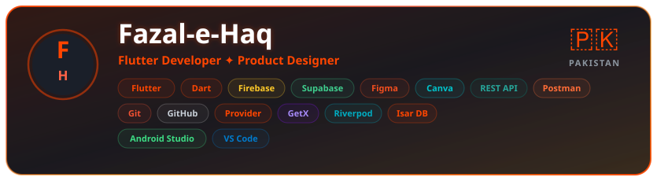
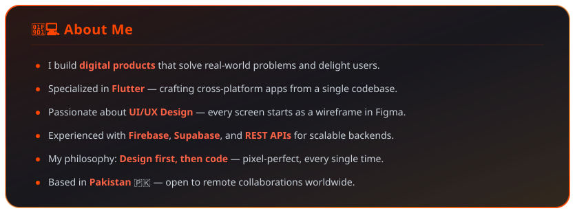
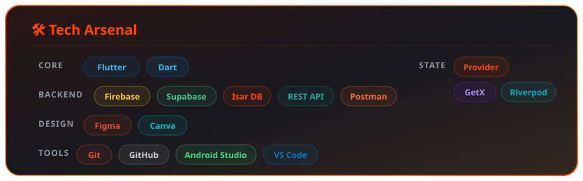
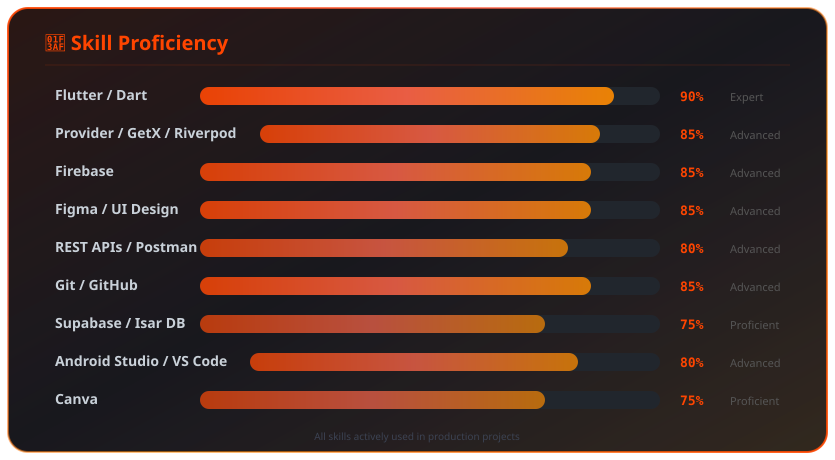
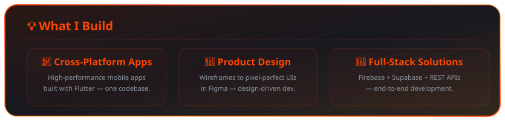
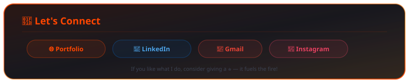

<!-- ╔═══════════════════════════════════════════════════════════════════╗ -->
<!-- ║    🔥  F A Z A L - E - H A Q  ·  v 5  ·  G i t S k i n s       ║ -->
<!-- ║    Every section is a custom SVG card · Fire Theme               ║ -->
<!-- ╚═══════════════════════════════════════════════════════════════════╝ -->

<!-- ━━━━━━━━━━━━━━━━━ HEADER ━━━━━━━━━━━━━━━━━ -->

  

 

<!-- ━━━━━━━━━━━━━━━━━ TYPING SVG ━━━━━━━━━━━━━━━━━ -->

  

 

<!-- ━━━━━━━━━━━━━━━━━ SOCIAL BADGES ━━━━━━━━━━━━━━━━━ -->

  &nbsp;
  &nbsp;
  &nbsp;
  

    

  
  &nbsp;
  
  &nbsp;
  

  

<!-- ━━━━━━━━━━━━━━━━━ HERO CARD ━━━━━━━━━━━━━━━━━ -->

  

 

<!-- ━━━━━━━━━━━━━━━━━ ABOUT ME CARD ━━━━━━━━━━━━━━━━━ -->

  

 

<!-- ━━━━━━━━━━━━━━━━━ TECH STACK CARD ━━━━━━━━━━━━━━━━━ -->

  

 

<!-- ━━━━━━━━━━━━━━━━━ SKILLS CARD ━━━━━━━━━━━━━━━━━ -->

  

 

<!-- ━━━━━━━━━━━━━━━━━ STREAK STATS ━━━━━━━━━━━━━━━━━ -->

  

 

<!-- ━━━━━━━━━━━━━━━━━ ACTIVITY GRAPH ━━━━━━━━━━━━━━━━━ -->

  

 

<!-- ━━━━━━━━━━━━━━━━━ WHAT I BUILD CARD ━━━━━━━━━━━━━━━━━ -->

  

 

<!-- ━━━━━━━━━━━━━━━━━ QUOTE ━━━━━━━━━━━━━━━━━ -->

  

 

<!-- ━━━━━━━━━━━━━━━━━ CONNECT CARD ━━━━━━━━━━━━━━━━━ -->

  

 

<!-- ━━━━━━━━━━━━━━━━━ FOOTER ━━━━━━━━━━━━━━━━━ -->

